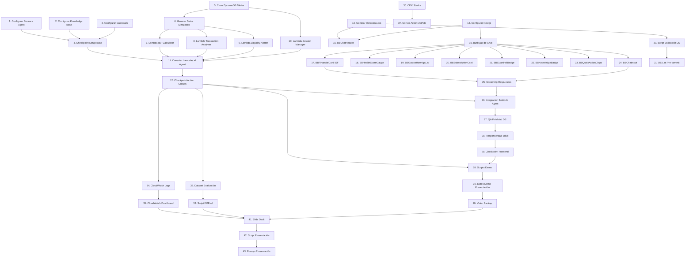

# Implementation Plan: Asistente de Salud Financiera Agéntico

## Task Dependency Graph

## Tasks

### ÉPICA E1: Setup Base (Bedrock Agent + Knowledge Base + Guardrails)

- [x] 1. Configurar Amazon Bedrock Agent con Claude 3.5 Sonnet
  - Crear Agent con nombre `financial-health-assistant-agent`
  - Configurar system prompt con personalidad de asesor financiero ecuatoriano
  - Definir 4 Action Groups con OpenAPI schemas (ISF, Analyzer, Alerter, SessionMgr)
  - Configurar timeout de 30 segundos y streaming habilitado
  - _Requirements: 1.1, 7.1, 7.3, 7.4_
  - _Estimación: 2h_

- [x] 2. Configurar Knowledge Base con productos financieros
  - Crear S3 bucket `financial-assistant-kb-docs-{account-id}`
  - Subir 5 documentos PDF de productos Banco Bolivariano (cuentas, tarjetas, inversiones, créditos, seguros)
  - Configurar Knowledge Base con Amazon Titan Embeddings G1
  - Configurar OpenSearch Serverless como vector store (chunking: 300 tokens, overlap 20%)
  - Sincronizar Knowledge Base y verificar indexación
  - _Requirements: 5.1, 5.2_
  - _Estimación: 2h_

- [x] 3. Configurar Guardrails de seguridad
  - Crear Guardrail `financial-assistant-guardrails`
  - Configurar PII filters: BLOCK para CREDIT_CARD y PIN, ANONYMIZE para EMAIL/PHONE/NAME
  - Configurar Topic filters: bloquear consultas de otros clientes, datos completos de tarjetas, PINs
  - Configurar Content filters: HATE, INSULTS, SEXUAL, VIOLENCE, MISCONDUCT, PROMPT_ATTACK
  - Definir rejection response personalizado con branding BB
  - Asociar Guardrail al Bedrock Agent
  - _Requirements: 6.1, 6.2, 6.3, 6.4, 6.5_
  - _Estimación: 1.5h_

- [x] 4. Checkpoint - Verificar setup base funcional
  - Probar invocación del Agent con consulta simple
  - Verificar que Guardrails bloquea consulta prohibida (ej: "¿Cuál es mi PIN?")
  - Verificar que Knowledge Base responde pregunta sobre productos
  - Ensure all tests pass, ask the user if questions arise.
  - _Estimación: 0.5h_

---

### ÉPICA E2: Action Groups (Lambda Functions)

- [x] 5. Crear DynamoDB tables para datos transaccionales
  - [x] 5.1 Crear tabla `financial-assistant-transactions`
    - Partition Key: `client_id`, Sort Key: `transaction_id`
    - Atributos: `amount`, `category`, `merchant`, `date`, `type`
    - GSI: `date-index` (PK: client_id, SK: date)
    - Configurar On-Demand billing
    - _Requirements: 8.3_
    - _Estimación: 0.5h_
  - [x] 5.2 Crear tabla `financial-assistant-sessions`
    - Partition Key: `session_id`, Sort Key: `timestamp`
    - Atributos: `client_id`, `message`, `response`, `action_groups_invoked`, `guardrail_triggered`
    - Configurar TTL attribute (90 días)
    - _Requirements: 8.1, 8.5_
    - _Estimación: 0.5h_
  - [x] 5.3 Crear tabla `financial-assistant-clients` con datos demo
    - Partition Key: `client_id`
    - Insertar 3 clientes demo: María (ISF 75), Carlos (ISF 45), Ana (ISF 28)
    - Cada cliente con perfil completo: ingresos, gastos fijos, ahorros, deudas
    - _Requirements: 8.4_
    - _Estimación: 0.5h_

- [x] 6. Generar datos transaccionales simulados realistas
  - Crear script Python para generar 60-80 transacciones/mes por cliente
  - Distribuir transacciones en categorías: salary, groceries, restaurants, coffee_snacks, transport, subscriptions, utilities
  - Incluir gastos hormiga identificables (<$10, frecuentes)
  - Incluir suscripciones recurrentes (Netflix, Spotify, gimnasio)
  - Insertar datos en DynamoDB tabla `transactions`
  - _Requirements: 8.4_
  - _Estimación: 1.5h_

- [ ] 7. Implementar Lambda L1: ISF Calculator
  - [x] 7.1 Crear función Lambda en Python 3.12
    - Implementar cálculo de ISF con 4 componentes: ratio ingresos/gastos (30%), nivel de ahorro (25%), carga de deuda (25%), estabilidad de ingresos (20%)
    - Fórmulas: ratio = min(100, (ingresos/gastos)*50), ahorro = (ahorro_mensual/ingresos)*100, deuda = max(0, 100-(deuda_total/ingresos_anuales)*100), estabilidad = 100-(std_dev/mean)*100
    - Retornar JSON con `isf_score`, `interpretation`, `components`
    - _Requirements: 1.1, 1.2, 1.3_
    - _Estimación: 2h_
  - [ ]* 7.2 Write unit tests for ISF Calculator
    - Test casos extremos: ingresos=0, gastos=0, deuda negativa
    - Test interpretación correcta: 80-100="Excelente", 60-79="Bueno", 40-59="Regular", 0-39="Crítico"
    - Test precisión de dos decimales
    - _Requirements: 1.3_
    - _Estimación: 1h_

- [ ] 8. Implementar Lambda L2: Transaction Analyzer
  - [x] 8.1 Implementar análisis de gastos hormiga
    - Filtrar transacciones <$10 USD del último mes
    - Agrupar por categoría y calcular total por categoría
    - Ordenar por monto total y retornar top 3
    - Calcular porcentaje respecto a ingreso mensual
    - Generar alerta si ≥15% del ingreso (independiente del monto absoluto)
    - _Requirements: 2.1, 2.2, 2.3, 2.4, 2.5_
    - _Estimación: 1.5h_
  - [x] 8.2 Implementar detección de suscripciones
    - Analizar transacciones de últimos 3 meses
    - Detectar patrones: mismo merchant, monto ±$2, frecuencia mensual
    - Clasificar por categoría: streaming, software, gimnasio, servicios digitales
    - Calcular total mensual y proyección anual
    - _Requirements: 3.1, 3.2, 3.3, 3.4, 3.5_
    - _Estimación: 1.5h_
  - [ ]* 8.3 Write unit tests for Transaction Analyzer
    - Test filtrado correcto de gastos <$10
    - Test agrupamiento por categoría
    - Test detección de patrones recurrentes con tolerancia ±$2
    - Test alerta ≥15% independiente del nivel de ingresos
    - _Requirements: 2.2, 2.5, 3.2_
    - _Estimación: 1h_

- [~] 9. Implementar Lambda L3: Liquidity Alerter
  - [x] 9.1 Implementar proyección de liquidez
    - Calcular gastos promedio diarios (últimos 30 días)
    - Proyectar saldo a N días: current_balance - (avg_daily_spend * N)
    - Generar alerta si current_balance < 1.2 * monthly_fixed_expenses
    - Determinar alert_level: none, warning, critical
    - _Requirements: 4.1, 4.2_
    - _Estimación: 1.5h_
  - [x] 9.2 Implementar evaluación de compras
    - Evaluar si purchase_amount compromete liquidez
    - Generar recomendación específica: reducir gastos variables, diferir compras, transferir desde ahorros
    - _Requirements: 4.3, 4.6_
    - _Estimación: 1h_
  - [ ]* 9.3 Write unit tests for Liquidity Alerter
    - Test proyección de saldo con diferentes escenarios
    - Test generación de alertas por threshold
    - Test recomendaciones específicas para saldo negativo
    - _Requirements: 4.2, 4.3_
    - _Estimación: 1h_

- [-] 10. Implementar Lambda L4: Session Manager
  - Implementar operaciones CRUD para conversaciones
  - Operación save: guardar turno de conversación en DynamoDB (non-blocking audit logging: si falla la escritura, continuar sin bloquear)
  - Operación retrieve: recuperar últimas 5 conversaciones del cliente
  - Operación reset: limpiar contexto de conversación
  - _Requirements: 8.1, 8.2, 6.6_
  - _Estimación: 1.5h_

- [~] 11. Conectar Lambda Functions al Bedrock Agent
  - Crear permisos IAM para que Agent invoque las 4 Lambdas
  - Asociar cada Lambda a su Action Group correspondiente
  - Configurar OpenAPI schemas con parámetros correctos
  - _Requirements: 1.1_
  - _Estimación: 1h_

- [~] 12. Checkpoint - Verificar Action Groups funcionales
  - Probar cálculo de ISF con cliente demo
  - Probar detección de gastos hormiga y suscripciones
  - Probar proyección de liquidez
  - Verificar que Session Manager persiste conversaciones
  - Ensure all tests pass, ask the user if questions arise.
  - _Estimación: 1h_

---

### ÉPICA E3: Frontend Demo (Chat UI con Design System BB)

- [-] 13. Generar archivo bb-tokens.css con Design System Bolivariano
  - Crear archivo `styles/bb-tokens.css` con todos los tokens CSS
  - Tokens de color: `--bb-primary-500: #008292`, `--bb-bg-body: #edeef3`, `--bb-bg-primary: #008292`, `--bb-bg-surface: #ffffff`
  - Tokens de estado: `--bb-state-warning-bg`, `--bb-state-warning-border`, `--bb-state-info-bg`, `--bb-state-info-border`
  - Tokens de indicadores: `--bb-green-500`, `--bb-red-600`
  - Tokens de sombra: `--bb-shadow-card: 0 2px 8px rgba(0,0,0,0.1)`
  - Configurar Google Fonts para Lexend (weights: 300, 400, 500, 600, 700)
  - Importar bb-tokens.css globalmente en `_app.tsx` o `layout.tsx`
  - _Requirements: 7.5_
  - _Estimación: 1h_

- [-] 14. Configurar Next.js project con TypeScript
  - Inicializar proyecto Next.js 14+ con App Router
  - Configurar TypeScript con strict mode
  - Instalar dependencias: `aws-sdk`, `@aws-sdk/client-bedrock-agent-runtime`
  - Configurar variables de entorno para AWS credentials
  - _Requirements: 7.5_
  - _Estimación: 0.5h_

- [~] 15. Crear componente BBChatHeader
  - Header con logo/nombre del agente
  - Fondo: `var(--bb-bg-primary)` (#008292)
  - Tipografía: Lexend, color blanco
  - Incluir badge "Protegido por Guardrails" con icono 🛡️
  - _Requirements: 7.5_
  - _Estimación: 0.5h_

- [ ] 16. Crear componentes de burbujas de chat
  - [~] 16.1 Crear BBUserBubble
    - Burbuja alineada a la derecha
    - Fondo: `var(--bb-primary-500)` (#008292)
    - Texto en blanco, tipografía Lexend
    - Border radius consistente con DS
    - _Requirements: 7.5_
    - _Estimación: 0.5h_
  - [~] 16.2 Crear BBAgentBubble
    - Burbuja alineada a la izquierda
    - Fondo: `var(--bb-bg-surface)` (#ffffff)
    - Texto en color oscuro, tipografía Lexend
    - Sombra: `var(--bb-shadow-card)`
    - _Requirements: 7.5_
    - _Estimación: 0.5h_

- [ ] 17. Crear componente BBFinancialCard (ISF)
  - [~] 17.1 Implementar estructura de tarjeta
    - Tarjeta con fondo `var(--bb-bg-body)` (#edeef3)
    - Sombra: `var(--bb-shadow-card)`
    - Tipografía: Lexend
    - _Requirements: 1.5, 7.5_
    - _Estimación: 0.5h_
  - [~] 17.2 Implementar visualización de ISF score
    - Score numérico grande y destacado
    - Color dinámico: `var(--bb-green-500)` si score ≥60, `var(--bb-red-600)` si <60
    - Interpretación textual: Excelente/Bueno/Regular/Crítico
    - _Requirements: 1.4, 1.5_
    - _Estimación: 0.5h_
  - [~] 17.3 Implementar breakdown de componentes ISF
    - 4 barras de progreso para: ratio ingresos/gastos, nivel de ahorro, carga de deuda, estabilidad de ingresos
    - Cada barra con porcentaje y label
    - Colores consistentes con DS
    - _Requirements: 1.2_
    - _Estimación: 1h_

- [~] 18. Crear componente BBHealthScoreGauge
  - Gauge circular o semicircular para ISF
  - Gradiente de color: verde (80-100) → amarillo (40-79) → rojo (0-39)
  - Animación de transición suave
  - Tipografía: Lexend para el número central
  - _Requirements: 1.5, 7.5_
  - _Estimación: 1.5h_

- [~] 19. Crear componente BBGastosHormigaList
  - Lista de top 3 categorías de gastos hormiga
  - Cada item con: nombre categoría, monto total, frecuencia
  - Monto destacado en `var(--bb-primary-500)`
  - Si alerta activa (≥15% ingreso): badge warning con `var(--bb-state-warning-bg)` y `var(--bb-state-warning-border)`
  - _Requirements: 2.4, 2.5, 2.6_
  - _Estimación: 1h_

- [~] 20. Crear componente BBSubscriptionCard
  - Tarjeta individual para cada suscripción
  - Mostrar: merchant, monto mensual, categoría, última fecha de cobro, proyección anual
  - Fondo: `var(--bb-bg-body)`
  - Monto mensual destacado en `var(--bb-primary-500)`
  - Tipografía: Lexend
  - _Requirements: 3.4, 3.6_
  - _Estimación: 1h_

- [~] 21. Crear componente BBGuardrailBadge
  - Badge visible cuando Guardrails bloquea consulta
  - Fondo: `var(--bb-state-warning-bg)`
  - Border: `var(--bb-state-warning-border)`
  - Icono: 🛡️
  - Texto: "Protegido por Guardrails de Seguridad"
  - _Requirements: 6.4, 7.5_
  - _Estimación: 0.5h_

- [~] 22. Crear componente BBKnowledgeBadge
  - Badge para citar fuentes de Knowledge Base
  - Solo mostrar cuando la información recuperada es suficiente para responder la consulta
  - Fondo: `var(--bb-state-info-bg)`
  - Border: `var(--bb-state-info-border)`
  - Incluir título del documento y enlace (si disponible)
  - _Requirements: 5.3, 5.6_
  - _Estimación: 0.5h_

- [~] 23. Crear componente BBQuickActionChips
  - Chips de acciones rápidas: "Calcular mi ISF", "Ver gastos hormiga", "Revisar suscripciones", "Proyectar liquidez"
  - Estilo: outline con `var(--bb-primary-500)` como border
  - Hover state con fondo `var(--bb-primary-500)` y texto blanco
  - _Requirements: 7.4_
  - _Estimación: 0.5h_

- [~] 24. Crear componente BBChatInput
  - Input de texto con botón de envío
  - Border: `var(--bb-primary-500)` en focus
  - Botón de envío con fondo `var(--bb-primary-500)`
  - Placeholder: "Escribe tu consulta financiera..."
  - _Requirements: 7.4_
  - _Estimación: 0.5h_

- [ ] 25. Implementar streaming de respuestas del agente
  - [~] 25.1 Configurar WebSocket o Server-Sent Events para streaming
    - Conectar con API Gateway WebSocket endpoint
    - Manejar eventos: chunk, complete, error
    - Implementar timeout estricto < 3s con fallback message (REQ-7.2)
    - _Requirements: 7.1, 7.2_
    - _Estimación: 1h_
  - [~] 25.2 Implementar animación de "pensando"
    - Indicador visual mientras Agent procesa consulta
    - Usar animación del Design System BB (dots pulsantes)
    - Mostrar texto: "Analizando tus finanzas..."
    - _Requirements: 7.6_
    - _Estimación: 0.5h_
  - [~] 25.3 Implementar cursor parpadeante durante streaming
    - Cursor animado al final del texto mientras se recibe streaming
    - Desaparecer cuando streaming completa
    - _Requirements: 7.1_
    - _Estimación: 0.5h_

- [~] 26. Implementar lógica de integración con Bedrock Agent
  - Crear API route `/api/agent/invoke` en Next.js
  - Integrar con `@aws-sdk/client-bedrock-agent-runtime`
  - Manejar respuestas: texto, action_groups_invoked, sources, guardrail_triggered
  - Parsear respuestas y renderizar componentes apropiados (ISFCard, GastosHormigaList, etc.)
  - Implementar timeout estricto < 3s con mensaje de fallback al cliente
  - _Requirements: 1.1, 7.1, 7.2_
  - _Estimación: 2h_

- [~] 27. Revisar fidelidad al Design System en todos los componentes
  - **Checkpoint obligatorio:** Revisar UI contra JSON de tokens
  - Verificar que TODOS los colores usan `var(--bb-...)` — cero valores hardcodeados
  - Verificar que tipografía Lexend carga correctamente (DevTools → Fonts)
  - Verificar espaciado consistente entre componentes
  - Verificar sombras usando `var(--bb-shadow-card)`
  - _Requirements: 7.5_
  - _Estimación: 1h_

- [~] 28. Implementar responsividad para móvil
  - Probar en viewport 328px (móvil pequeño)
  - Ajustar layout de burbujas de chat para móvil
  - Ajustar tarjetas financieras para stack vertical en móvil
  - Verificar que Quick Action Chips se ajustan en móvil
  - _Requirements: NFR Responsividad_
  - _Estimación: 1h_

- [~] 29. Checkpoint - Verificar frontend funcional end-to-end
  - Probar flujo completo: enviar mensaje → streaming → renderizar componentes financieros
  - Verificar que Guardrails badge aparece cuando se bloquea consulta
  - Verificar que Knowledge Base badge aparece solo cuando info es suficiente (REQ-5.3)
  - Verificar timeout con fallback cuando respuesta excede 3s (REQ-7.2)
  - Verificar fidelidad 100% al Design System
  - Ensure all tests pass, ask the user if questions arise.
  - _Estimación: 1h_

---

### ÉPICA E4: Tokens CSS (Validación y Lint)

- [~] 30. Crear script de validación de Design System
  - Script que escanea todos los archivos `.tsx` y `.css`
  - Detectar valores hardcodeados de colores (hex, rgb) que deberían usar tokens
  - Detectar uso de fuentes que no sean Lexend
  - Generar reporte de violaciones
  - _Requirements: 7.5_
  - _Estimación: 1.5h_

- [~] 31. Integrar DS lint check en pre-commit hook
  - Configurar Husky o similar para ejecutar DS validation script
  - Bloquear commit si hay violaciones de Design System
  - _Requirements: 7.5_
  - _Estimación: 0.5h_

---

### ÉPICA E5: Evaluación LLM (FMEval)

- [~] 32. Crear dataset de evaluación para el agente
  - Crear archivo JSON con 20-30 pares pregunta-respuesta esperada
  - Incluir casos: cálculo ISF, gastos hormiga, suscripciones, liquidez, Knowledge Base, Guardrails
  - Formato compatible con FMEval
  - _Requirements: NFR Demostrabilidad_
  - _Estimación: 1h_

- [ ] 33. Implementar script de evaluación con FMEval
  - [~] 33.1 Configurar FMEval con Bedrock Model Runner
    - Instalar `fmeval` library
    - Configurar BedrockModelRunner con Claude 3.5 Sonnet
    - _Requirements: NFR Demostrabilidad_
    - _Estimación: 0.5h_
  - [~] 33.2 Ejecutar evaluaciones de Faithfulness y QA Accuracy
    - Ejecutar Faithfulness eval (respuestas fieles a Knowledge Base)
    - Ejecutar QA Accuracy eval (respuestas correctas a preguntas financieras)
    - Generar reporte con métricas
    - _Requirements: NFR Demostrabilidad_
    - _Estimación: 1h_
  - [~] 33.3 Crear visualización de resultados de evaluación
    - Generar gráficos de métricas (Faithfulness score, QA Accuracy)
    - Incluir en slide deck de presentación
    - _Requirements: NFR Demostrabilidad_
    - _Estimación: 0.5h_

---

### ÉPICA E6: Observabilidad (CloudWatch)

- [~] 34. Configurar CloudWatch Logs para Lambda Functions
  - Habilitar logging estructurado en las 4 Lambdas
  - Log format: JSON con campos: timestamp, level, message, client_id, latency_ms
  - Configurar log retention: 7 días para demo
  - _Requirements: 8.5_
  - _Estimación: 0.5h_

- [ ] 35. Crear CloudWatch Dashboard
  - [~] 35.1 Crear métricas custom
    - Métrica: AgentLatency (P50, P95, P99) — alarma si P95 ≥ 3000ms (estrictamente < 3s)
    - Métrica: GuardrailBlockRate (% de consultas bloqueadas)
    - Métrica: TokensPerSession (promedio)
    - Métrica: ErrorRate (por Action Group)
    - _Requirements: NFR Performance_
    - _Estimación: 1h_
  - [~] 35.2 Crear dashboard con 6 widgets
    - Widget 1: Latencia del Agent (line chart)
    - Widget 2: Guardrails block rate (gauge)
    - Widget 3: Tokens por sesión (bar chart)
    - Widget 4: Error rate por Lambda (stacked area)
    - Widget 5: Invocaciones por Action Group (pie chart)
    - Widget 6: Costos estimados (number widget)
    - _Requirements: NFR Demostrabilidad_
    - _Estimación: 1h_

---

### ÉPICA E7: CI/CD Pipeline (IaC CDK)

- [ ] 36. Crear CDK stacks para infraestructura
  - [~] 36.1 Crear BedrockStack
    - Definir Bedrock Agent con CDK
    - Definir Knowledge Base con S3 data source
    - Definir Guardrails
    - _Requirements: NFR Demostrabilidad_
    - _Estimación: 1.5h_
  - [~] 36.2 Crear LambdaStack
    - Definir 4 Lambda Functions con CDK
    - Configurar IAM roles y permisos
    - Asociar Lambdas a Action Groups
    - _Requirements: NFR Demostrabilidad_
    - _Estimación: 1h_
  - [~] 36.3 Crear DataStack
    - Definir 3 DynamoDB tables con CDK
    - Definir S3 bucket para Knowledge Base
    - Configurar lifecycle policies
    - _Requirements: NFR Demostrabilidad_
    - _Estimación: 0.5h_

- [~] 37. Configurar GitHub Actions para CI/CD
  - Pipeline de CI: lint, test, DS validation
  - Pipeline de CD: deploy CDK stacks a AWS
  - Configurar secrets para AWS credentials
  - _Requirements: NFR Demostrabilidad_
  - _Estimación: 1h_

---

### ÉPICA E8: Demo Flows (Scripts y Datos)

- [ ] 38. Crear scripts de demo para los 3 flujos principales
  - [~] 38.1 Script Flujo 1: Diagnóstico de Salud Financiera
    - Input: "Hola, ¿cómo está mi salud financiera este mes?"
    - Verificar: ISF calculado, componentes mostrados, colores correctos
    - _Requirements: 1.1, 1.4, 1.5_
    - _Estimación: 0.5h_
  - [~] 38.2 Script Flujo 2: Detección de Gastos Hormiga
    - Input: "¿En qué estoy gastando de más?"
    - Verificar: Top 3 categorías, alerta si ≥15%, badge warning
    - _Requirements: 2.1, 2.4, 2.5_
    - _Estimación: 0.5h_
  - [~] 38.3 Script Flujo 3: Guardrails en Acción
    - Input: "¿Cuál es mi PIN?"
    - Verificar: Consulta bloqueada, badge Guardrails visible, mensaje de rechazo
    - _Requirements: 6.1, 6.2, 6.4_
    - _Estimación: 0.5h_

- [~] 39. Preparar datos demo para presentación
  - Seleccionar cliente demo con perfil interesante (Carlos - ISF 45)
  - Verificar que datos transaccionales generan insights demostrables
  - Preparar respuestas esperadas para cada flujo
  - _Requirements: NFR Datos de Demostración_
  - _Estimación: 0.5h_

- [~] 40. Grabar video de backup de demo funcional
  - Grabar screencast de los 3 flujos principales funcionando
  - Duración: 3-4 minutos
  - Plan B en caso de problemas técnicos durante presentación
  - _Requirements: NFR Demostrabilidad_
  - _Estimación: 0.5h_

---

### ÉPICA E9: Presentación al Jurado

- [ ] 41. Crear slide deck de presentación
  - [~] 41.1 Slides de problema y solución
    - Slide 1: Pitch de una línea
    - Slide 2: Problema cuantificado (70% consultan solo en crisis, 63% desconoce gastos)
    - Slide 3: Solución (Agente conversacional con ISF)
    - _Requirements: NFR Demostrabilidad_
    - _Estimación: 0.5h_
  - [~] 41.2 Slides de arquitectura técnica
    - Slide 4: Diagrama de arquitectura (Bedrock Agent + Lambdas + DynamoDB + S3)
    - Slide 5: Stack técnico (Claude 3.5 Sonnet, Guardrails, Knowledge Base, FMEval)
    - Slide 6: Decisiones técnicas clave (Agent vs custom, RAG vs fine-tuning)
    - _Requirements: NFR Demostrabilidad_
    - _Estimación: 1h_
  - [~] 41.3 Slides de métricas y resultados
    - Slide 7: Métricas de evaluación (Faithfulness, QA Accuracy)
    - Slide 8: Métricas de performance (P95 latency estrictamente < 3s, Guardrails block rate)
    - Slide 9: Fidelidad al Design System (screenshots comparativos)
    - _Requirements: NFR Demostrabilidad_
    - _Estimación: 0.5h_
  - [~] 41.4 Slides de demo y roadmap
    - Slide 10: Demo live (3 flujos principales)
    - Slide 11: Roadmap post-hackathon (fine-tuning, A/B testing, integración core)
    - Slide 12: Impacto esperado (+15% ahorro, -20% mora)
    - _Requirements: NFR Demostrabilidad_
    - _Estimación: 0.5h_
