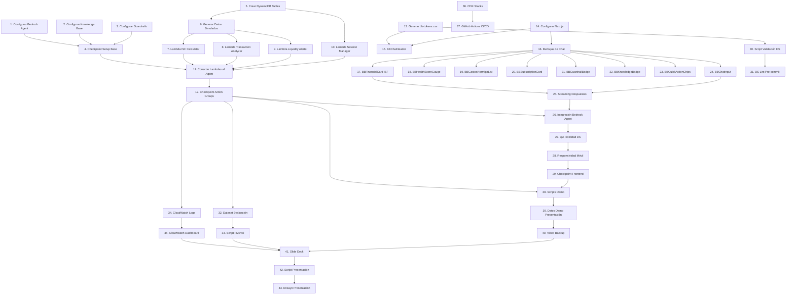

# Implementation Plan: Asistente de Salud Financiera Agéntico

## Task Dependency Graph

## Tasks

### ÉPICA E1: Setup Base (Bedrock Agent + Knowledge Base + Guardrails)

- [ ] 1. Configurar Amazon Bedrock Agent con Claude 3.5 Sonnet
  - Crear Agent con nombre `financial-health-assistant-agent`
  - Configurar system prompt con personalidad de asesor financiero ecuatoriano
  - Definir 4 Action Groups con OpenAPI schemas (ISF, Analyzer, Alerter, SessionMgr)
  - Configurar timeout de 30 segundos y streaming habilitado
  - _Requirements: 1.1, 7.1, 7.3, 7.4_
  - _Estimación: 2h_

- [ ] 2. Configurar Knowledge Base con productos financieros
  - Crear S3 bucket `financial-assistant-kb-docs-{account-id}`
  - Subir 5 documentos PDF de productos Banco Bolivariano (cuentas, tarjetas, inversiones, créditos, seguros)
  - Configurar Knowledge Base con Amazon Titan Embeddings G1
  - Configurar OpenSearch Serverless como vector store (chunking: 300 tokens, overlap 20%)
  - Sincronizar Knowledge Base y verificar indexación
  - _Requirements: 5.1, 5.2_
  - _Estimación: 2h_

- [ ] 3. Configurar Guardrails de seguridad
  - Crear Guardrail `financial-assistant-guardrails`
  - Configurar PII filters: BLOCK para CREDIT_CARD y PIN, ANONYMIZE para EMAIL/PHONE/NAME
  - Configurar Topic filters: bloquear consultas de otros clientes, datos completos de tarjetas, PINs
  - Configurar Content filters: HATE, INSULTS, SEXUAL, VIOLENCE, MISCONDUCT, PROMPT_ATTACK
  - Definir rejection response personalizado con branding BB
  - Asociar Guardrail al Bedrock Agent
  - _Requirements: 6.1, 6.2, 6.3, 6.4, 6.5_
  - _Estimación: 1.5h_

- [ ] 4. Checkpoint - Verificar setup base funcional
  - Probar invocación del Agent con consulta simple
  - Verificar que Guardrails bloquea consulta prohibida (ej: "¿Cuál es mi PIN?")
  - Verificar que Knowledge Base responde pregunta sobre productos
  - Ensure all tests pass, ask the user if questions arise.
  - _Estimación: 0.5h_

---

### ÉPICA E2: Action Groups (Lambda Functions)

- [ ] 5. Crear DynamoDB tables para datos transaccionales
  - [ ] 5.1 Crear tabla `financial-assistant-transactions`
    - Partition Key: `client_id`, Sort Key: `transaction_id`
    - Atributos: `amount`, `category`, `merchant`, `date`, `type`
    - GSI: `date-index` (PK: client_id, SK: date)
    - Configurar On-Demand billing
    - _Requirements: 8.3_
    - _Estimación: 0.5h_
  - [ ] 5.2 Crear tabla `financial-assistant-sessions`
    - Partition Key: `session_id`, Sort Key: `timestamp`
    - Atributos: `client_id`, `message`, `response`, `action_groups_invoked`, `guardrail_triggered`
    - Configurar TTL attribute (90 días)
    - _Requirements: 8.1, 8.5_
    - _Estimación: 0.5h_
  - [ ] 5.3 Crear tabla `financial-assistant-clients` con datos demo
    - Partition Key: `client_id`
    - Insertar 3 clientes demo: María (ISF 75), Carlos (ISF 45), Ana (ISF 28)
    - Cada cliente con perfil completo: ingresos, gastos fijos, ahorros, deudas
    - _Requirements: 8.4_
    - _Estimación: 0.5h_

- [ ] 6. Generar datos transaccionales simulados realistas
  - Crear script Python para generar 60-80 transacciones/mes por cliente
  - Distribuir transacciones en categorías: salary, groceries, restaurants, coffee_snacks, transport, subscriptions, utilities
  - Incluir gastos hormiga identificables (<$10, frecuentes)
  - Incluir suscripciones recurrentes (Netflix, Spotify, gimnasio)
  - Insertar datos en DynamoDB tabla `transactions`
  - _Requirements: 8.4_
  - _Estimación: 1.5h_

- [ ] 7. Implementar Lambda L1: ISF Calculator
  - [ ] 7.1 Crear función Lambda en Python 3.12
    - Implementar cálculo de ISF con 4 componentes: ratio ingresos/gastos (30%), nivel de ahorro (25%), carga de deuda (25%), estabilidad de ingresos (20%)
    - Fórmulas: ratio = min(100, (ingresos/gastos)*50), ahorro = (ahorro_mensual/ingresos)*100, deuda = max(0, 100-(deuda_total/ingresos_anuales)*100), estabilidad = 100-(std_dev/mean)*100
    - Retornar JSON con `isf_score`, `interpretation`, `components`
    - _Requirements: 1.1, 1.2, 1.3_
    - _Estimación: 2h_
  - [ ]* 7.2 Write unit tests for ISF Calculator
    - Test casos extremos: ingresos=0, gastos=0, deuda negativa
    - Test interpretación correcta: 80-100="Excelente", 60-79="Bueno", 40-59="Regular", 0-39="Crítico"
    - Test precisión de dos decimales
    - _Requirements: 1.3_
    - _Estimación: 1h_
